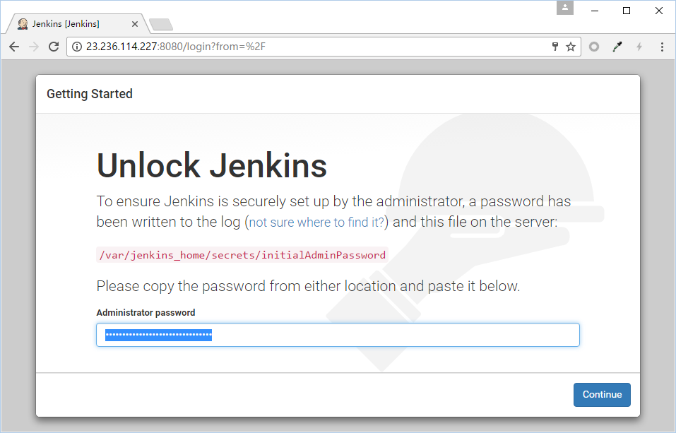
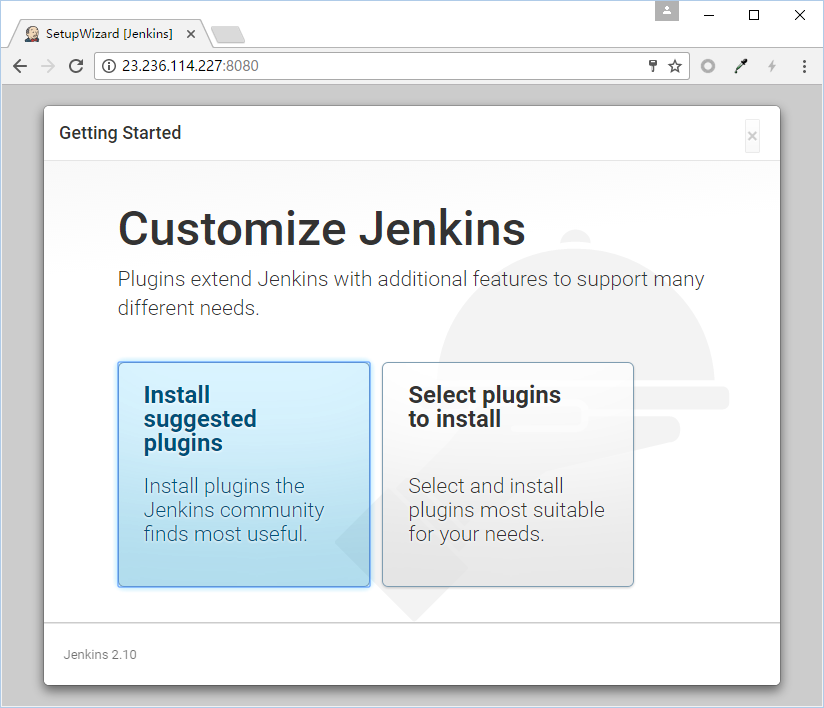
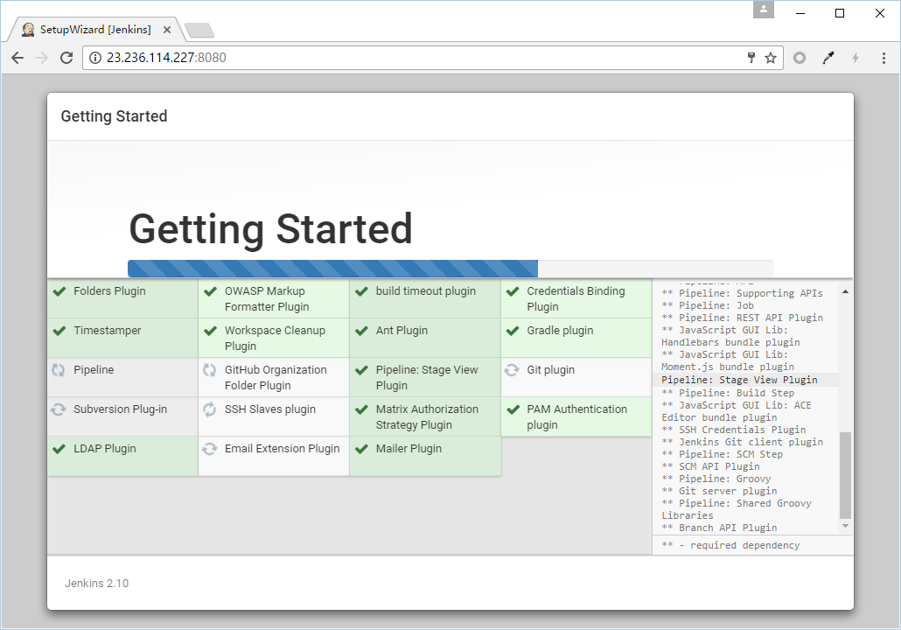
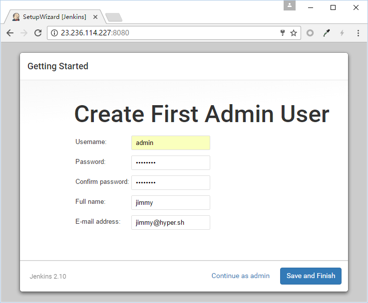
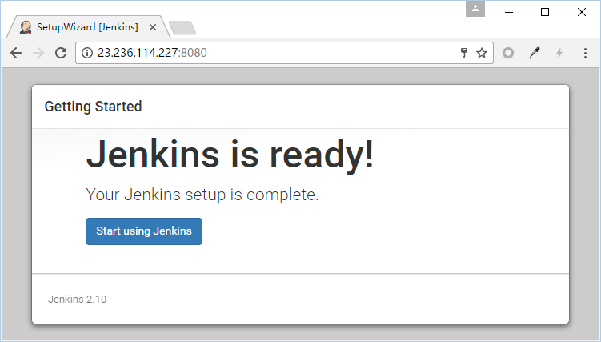
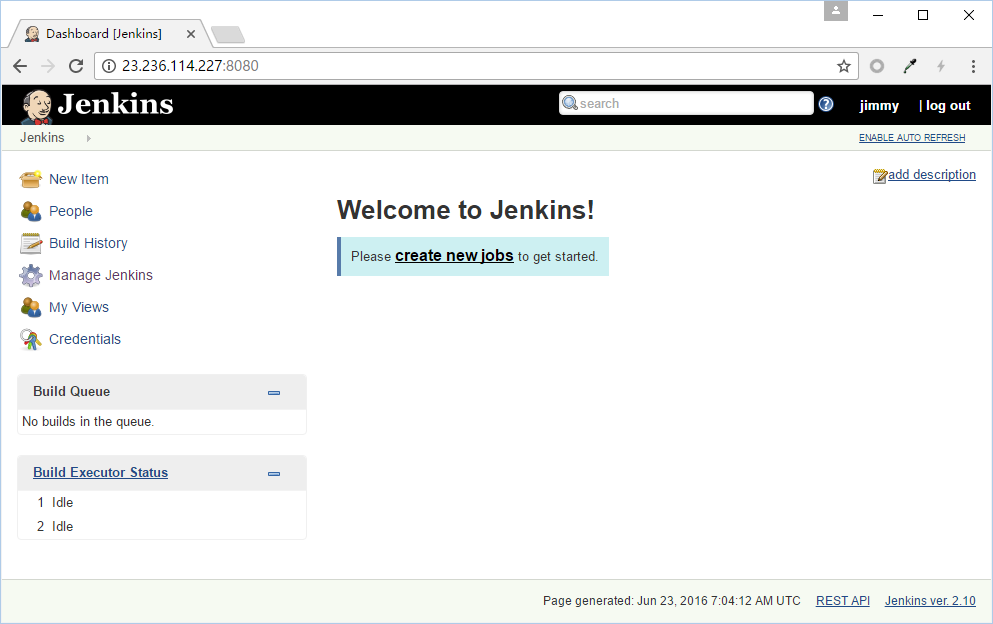

Dockerfile for build image `hyperhq/jenkins-hypercli`

# build image
```
./weekly.sh
```

# image on docker hub
https://hub.docker.com/r/hyperhq/jenkins-hypercli/


# run jenkens on Hyper

## allocate pubic ip
```
$ hyper fip allocate 1
23.236.114.227
```

## create volume
```
$ hyper volume create --name jenkins-data
```

## run jenkins container
```
$ ACCESS_KEY=xxxxxxxxxxxxxxxxxxxxxxxxxx
$ SECRET_KEY=xxxxxxxxxxxxxxxxxxxxxxxxxx
$ hyper run -d --size=l --name jenkins-hyper-demo -v jenkins-data:/var/jenkins_home -e ACCESS_KEY=$ACCESS_KEY -e SECRET_KEY=$SECRET_KEY hyperhq/jenkins-hypercli:2.10
```

## associate public ip to jenkins container
```
$ hyper fip associate 23.236.114.227 jenkins-hyper-demo
```

## list container
```
$ hyper ps
CONTAINER ID     IMAGE                           COMMAND                  CREATED          STATUS          PORTS                                              NAMES                PUBLIC IP
74400e10bd96     hyperhq/jenkins-hypercli:2.10   "/bin/tini -- /usr/lo"   7 minutes ago    Up 6 minutes    0.0.0.0:8080->8080/tcp, 0.0.0.0:50000->50000/tcp   jenkins-hyper-demo   23.236.114.227
```

## test hypercli in jenkins container
> show tenantid of Hyper_
```
$ hyper exec -it jenkins-hyper-demo hyper info | grep ID
ID: 56bfa4e8063c4872abad2f21b2616dd4
```

## get unlock password
```
$ hyper logs jenkins-hyper-demo
...
*************************************************************
*************************************************************
*************************************************************

Jenkins initial setup is required. An admin user has been created and a password generated.
Please use the following password to proceed to installation:

e85299cb69274de48f5a09a90a9ae821

This may also be found at: /var/jenkins_home/secrets/initialAdminPassword
```

## open jenkins web ui
```
open http://23.236.114.227:8080 in browser
```

## init jenkins following the wizard

### unlock jenkins


### customize plugins


### install plugins


### create first admin user


### jenkins is ready


### login jenkins

